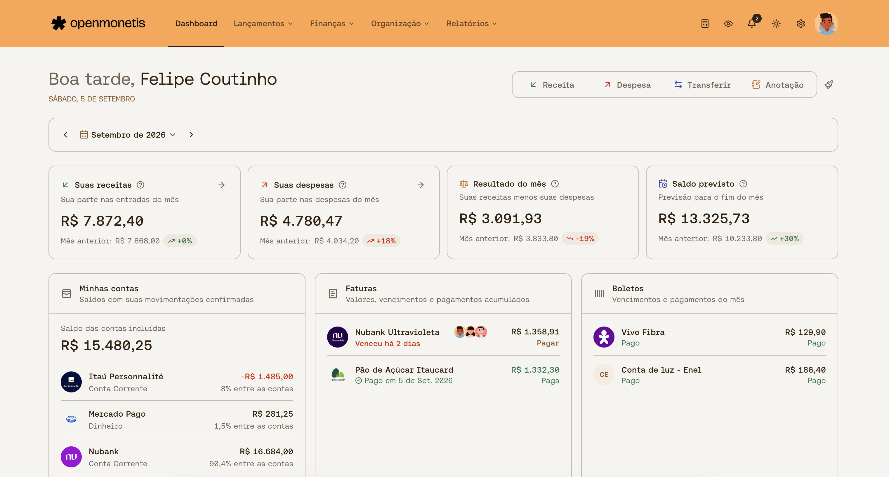

<p align="center">
  
</p>

<h1 align="center">OpenMonetis</h1>

<p align="center">
  Gerenciador de finanças pessoais self-hosted, feito para acompanhar sua vida financeira com
  clareza e manter seus dados sob seu controle.
</p>

<p align="center">
  <a href="LICENSE"></a>
  <a href="CHANGELOG.md"></a>
  
</p>

<p align="center">
  <a href="#instalação-rápida">Instalação</a> ·
  <a href="docs/production-deployment.md">Produção</a> ·
  <a href="docs/architecture.md">Arquitetura</a> ·
  <a href="CHANGELOG.md">Changelog</a> ·
  <a href="CONTRIBUTING.md">Contribuir</a>
</p>

<p align="center">
  
</p>

## O que você encontra

- contas, cartões, faturas, transações e transferências;
- parcelas, recorrências, orçamentos e contas a pagar;
- pessoas, divisões, repasses e gastos compartilhados entre contas;
- categorias, estabelecimentos, notas e checklists, além de anexos quando um storage S3 está
  configurado;
- relatórios, dashboard mensal e widgets configuráveis;
- importação por planilha e caixa de entrada do Companion Android com regras configuráveis de
  categorização e pessoa.

## Instalação rápida

Tenha Git e Docker com o plugin Compose instalados.

### Linux e macOS

```bash
curl -fsSL https://github.com/felipegcoutinho/openmonetis-v2/raw/refs/heads/main/install.sh | bash
```

### Windows

No PowerShell, com o Docker Desktop em execução:

```powershell
irm https://github.com/felipegcoutinho/openmonetis-v2/raw/refs/heads/main/install.ps1 | iex
```

Abra [http://localhost:7002](http://localhost:7002) e crie sua conta. Antes de executar um script
remoto, você pode revisar o [`install.sh`](install.sh) ou o [`install.ps1`](install.ps1).

Para publicar a aplicação com HTTPS, storage privado e segredos próprios, consulte o
[`guia de produção`](docs/production-deployment.md).

## Antes de usar

- O OpenMonetis é self-hosted: banco, storage, HTTPS, atualizações e backups são responsabilidade de
  quem mantém a instalação.
- Não existe integração com Open Finance. Os dados são inseridos manualmente, por planilha ou pelo
  fluxo de revisão do Companion.
- O único cliente implementado neste monorepo é o web. O Companion Android é um projeto externo
  que usa os endpoints de integração documentados e não substitui um aplicativo mobile completo.
- A recuperação da instalação é operacional: preserve o PostgreSQL com `pg_dump`, o bucket de
  anexos e os segredos da implantação conforme o guia de produção.

## Desenvolvimento

Tenha Node.js 20.19 ou 22.12 ou superior (LTS), Git e Docker com o plugin Compose instalados.

```bash
git clone https://github.com/felipegcoutinho/openmonetis-v2.git
cd openmonetis-v2

corepack enable
corepack prepare pnpm@11.25.0 --activate
pnpm install --frozen-lockfile

cp .env.example .env
pnpm docker:db
pnpm db:migrate
pnpm dev
```

A aplicação web fica em `http://localhost:7002`, a API em `http://localhost:7001` e o PostgreSQL em
`127.0.0.1:7000`.

Comandos de validação:

```bash
pnpm check
pnpm test
pnpm build
```

`pnpm lint` executa o Biome e a integração de `@shadcn/lint` via Oxlint no frontend.
Para executar apenas essa integração, use `pnpm lint:ui`. O plugin está registrado em
`apps/web/.oxlintrc.json`, inicialmente sem regras visuais ativadas; adicione as regras em
`rules` conforme a política visual desejada. Consulte as
[regras disponíveis](https://github.com/shadcn-ui/lint#rules). O tema e os componentes são
descobertos pelo `apps/web/components.json`. O Biome continua responsável pelas regras gerais.

## Arquitetura

O projeto é um monorepo TypeScript API-first. A API é a fonte de verdade, o domínio concentra as
regras financeiras e o cliente web apenas consulta e apresenta esse estado.

```text
TanStack Start -> Hono -> services -> domain
                              └-----> repositories -> Drizzle -> PostgreSQL
```

Stack principal: React, TanStack Start, Hono, Zod, Better Auth, Drizzle e PostgreSQL. Veja os
detalhes e as convenções no [`guia de arquitetura`](docs/architecture.md).

## Documentação

- [`docs/production-deployment.md`](docs/production-deployment.md): instalação, atualização,
  segurança operacional e backups;
- [`docs/architecture.md`](docs/architecture.md): camadas, decisões e estrutura do monorepo;
- [`docs/companion-api.md`](docs/companion-api.md): contrato do Companion;
- [`CONTRIBUTING.md`](CONTRIBUTING.md): fluxo para contribuições;
- [`SECURITY.md`](SECURITY.md): comunicação responsável de vulnerabilidades.

## Licença

O OpenMonetis usa a [Sustainable Use License 1.0](LICENSE). O uso pessoal, não comercial e interno é
permitido; exploração comercial exige autorização separada do titular.
